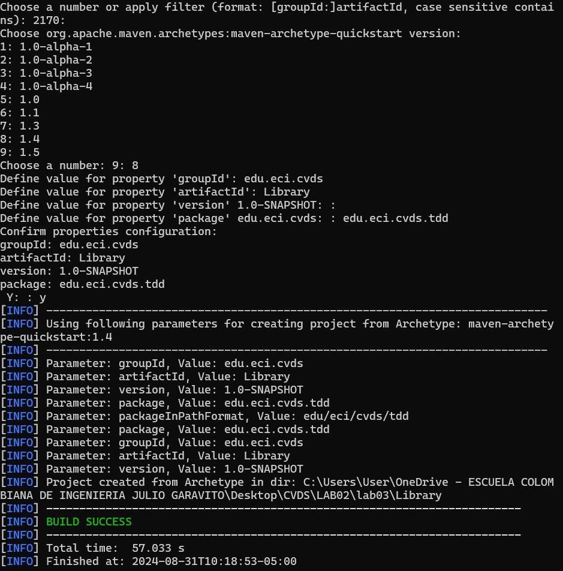
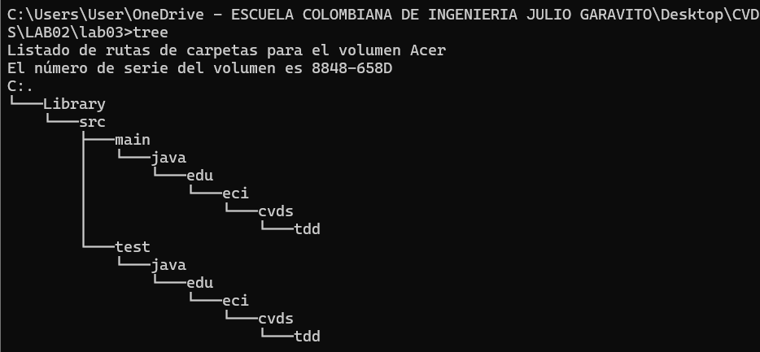
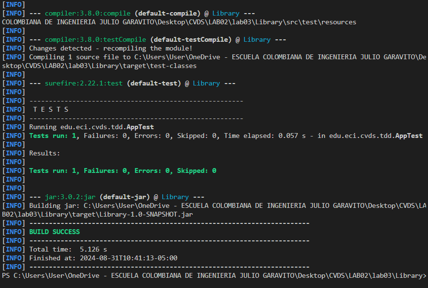
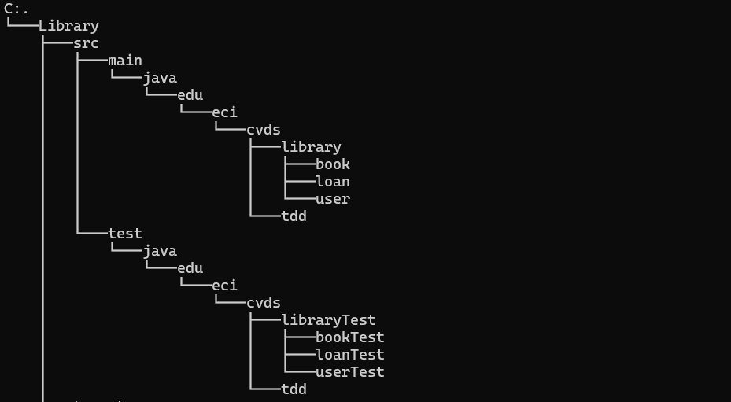

# LABORATORIO 3 - TDD

#### TALLER 3

### Integrantes

Andres Serrato
Zayra Gutierrez

### CREAR PROYECTO CON MAVEN

### AGREGAR DEPENDENCIA JUNIT5
El proeycto compila bien.

### AGREGAR ESQUELETO DEL PROYECTO
Carpetas agregadas correctamente

### AGREGAR CLASES
