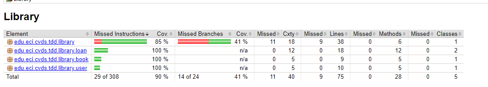

# LABORATORIO 3 - TDD

#### TALLER 3

### Integrantes

Andres Serrato
Zayra Gutierrez

### CREAR PROYECTO CON MAVEN

### AGREGAR DEPENDENCIA JUNIT5

El proeycto compila bien.

### AGREGAR ESQUELETO DEL PROYECTO

Carpetas agregadas correctamente

### AGREGAR CLASES

Compila correctamente

### COBERTURA

Se le asigna el codigo del pom.xml para Jacoco

La carpeta fue creada con éxito

### SONARQUBE

Ejecutamos los comando para la creación de la imagen en docker 

Creamos el token

Se añade sonar al archivo pom.xml del proyecto

Se añaden las propiedades de sonarqube y Jacoco

#### Se compila de nuevo Jacoco

#### Generamos la integración de sonarqube

### PRUEBAS UNITARIAS Y TDD

Temos el jacoco para saber el nivel de testeo del código

#### Test antes de la implementación de la clase addBook

#### Test despues de implementar la clase addBook

#### Test antes de la implementación de la clase loan

#### Test despues de la implementación de la clase loan

### Reporte Test

Despues de crear los test de las clases realizamos un reporte en Jacoco para ver el estado del código

