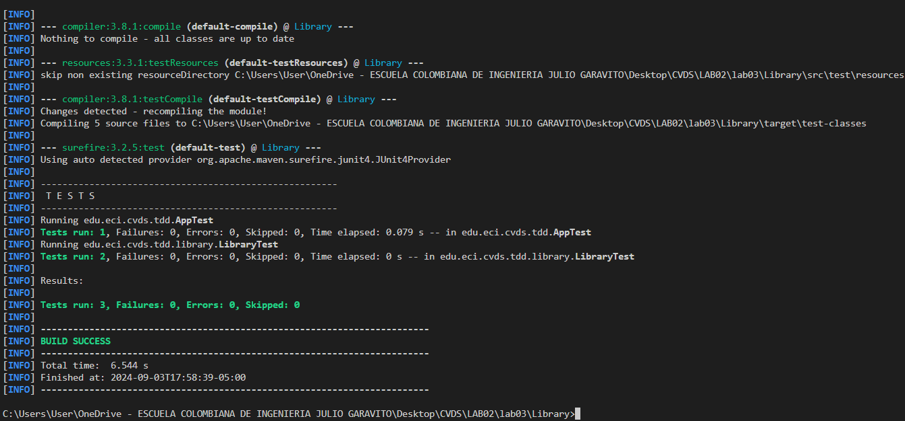
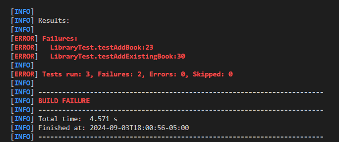
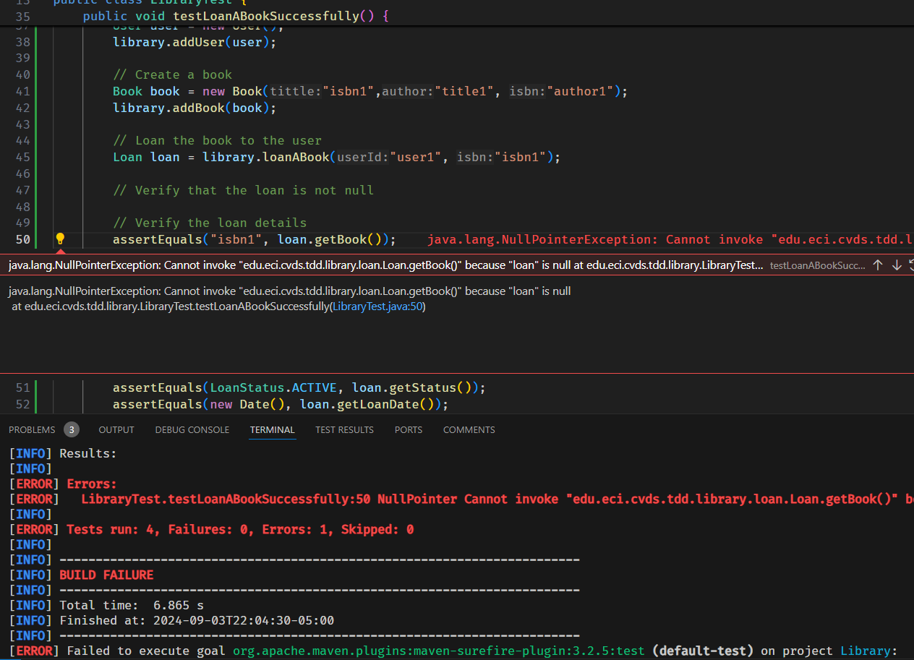
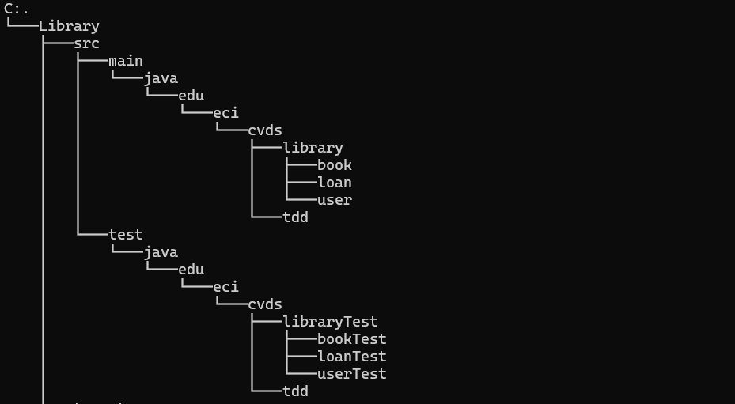
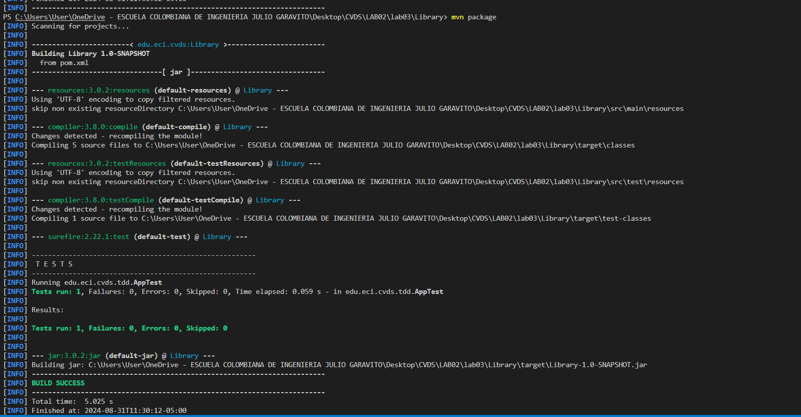
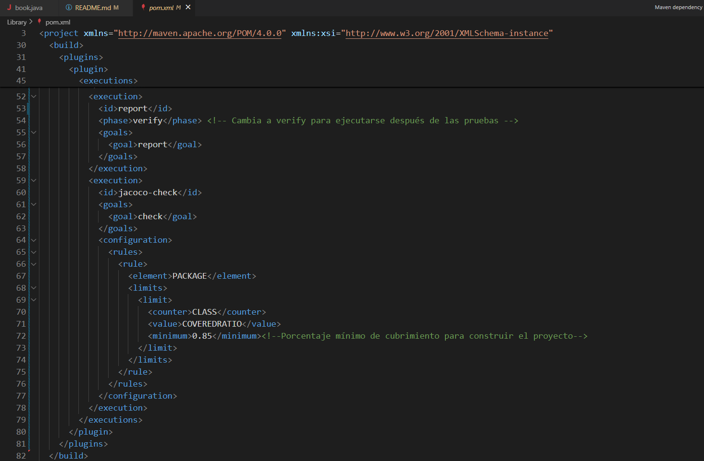
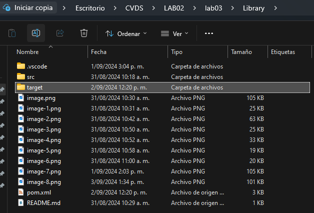
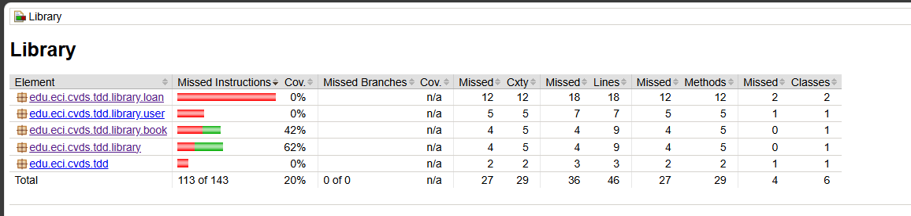
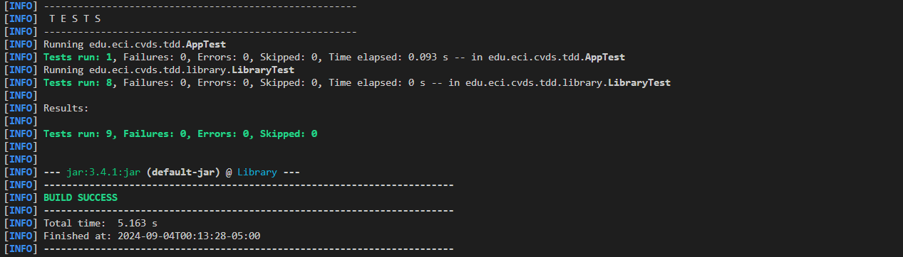
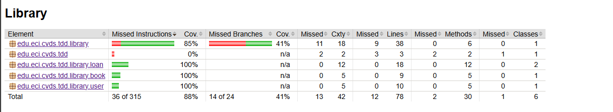

# LABORATORIO 3 - TDD

#### TALLER 3

### Integrantes

Andres Serrato
Zayra Gutierrez

### CREAR PROYECTO CON MAVEN

### AGREGAR DEPENDENCIA JUNIT5

El proeycto compila bien.

### AGREGAR ESQUELETO DEL PROYECTO

Carpetas agregadas correctamente

### AGREGAR CLASES

Compila correctamente

### COBERTURA

Se le asigna el codigo del pom.xml para Jacoco

La carpeta fue creada con éxito

### SONARQUBE

### PRUEBAS UNITARIAS Y TDD

Temos el jacoco para saber el nivel de testeo del codigo

#### Test antes de la implementacion de la clase addBook

#### Test despues de implementar la clase addBook

#### Test antes de la implementacion de la clase loan

#### Test despues de la implementacion de la clase loan

### Reporte Test

Despues de crear los test de las clases realizamos un reporte en Jacoco para ver el estado del código
